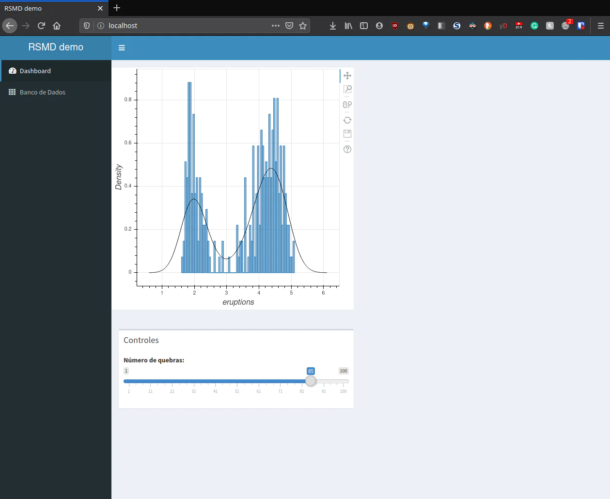
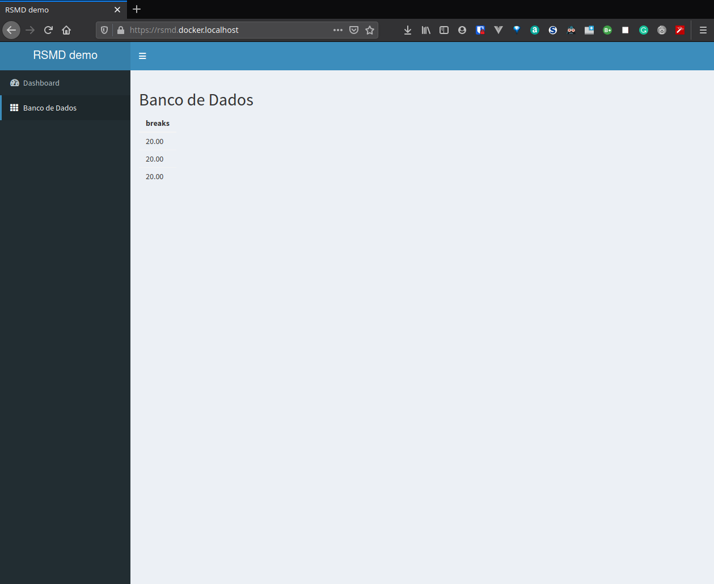
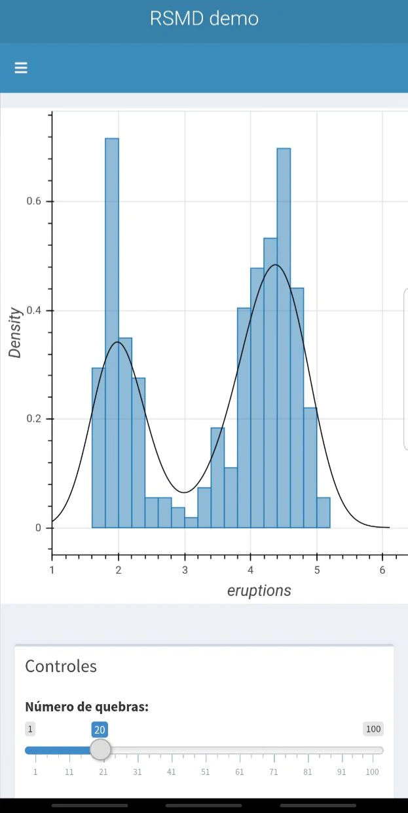
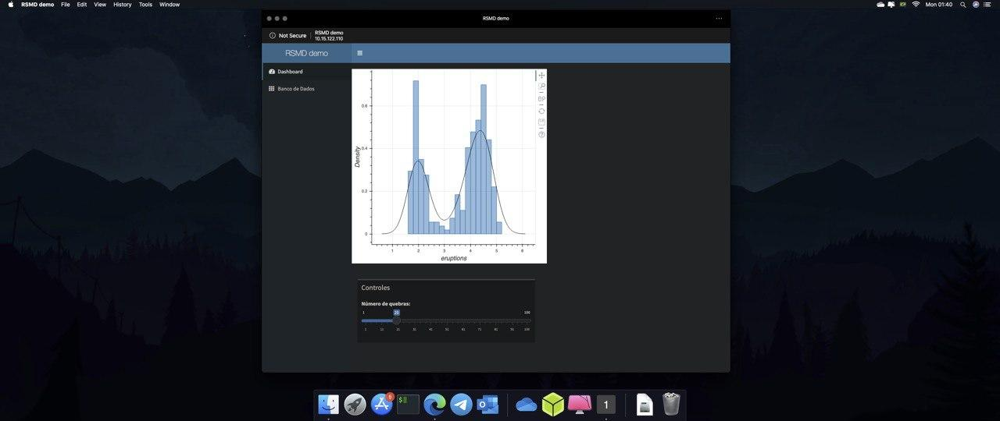

# RSMD

R + Shiny + Mongo + Docker

<div align = "center">
<br>

<br>
<br>

[](https://github.com/Fazendaaa/RSMD/.github/workflows/ci.yml)
[](https://github.com/Fazendaaa/RSMD/.github/workflows/cd.yml)

[](https://www.r-project.org/)
[](https://www.mongodb.com/)
[](https://www.docker.com/)
[](https://code.visualstudio.com/)
[](https://github.com/Fazendaaa/RSMD/LICENSE.html)
[](https://github.com/Fazendaaa/RSMD/releases/)

</div>

- [RSMD](#rsmd)
  - [Ideia](#ideia)
  - [Versões](#versões)
  - [Rodar](#rodar)
    - [Sem o código e sem BD](#sem-o-código-e-sem-bd)
    - [Com o código e com BD](#com-o-código-e-com-bd)
    - [Sem o código e com BD](#sem-o-código-e-com-bd)
  - [Banco de Dados](#banco-de-dados)
  - [Celular](#celular)
  - [Progressive Web Apps](#progressive-web-apps)
    - [Smartphone](#smartphone)
    - [Computador](#computador)
  - [CI/CD](#cicd)
  - [TODO](#todo)
  - [Autor](#autor)
  - [Licença](#licença)
  - [Referências](#referências)

## Ideia

Mesmo sendo um projeto que utiliza R e Mongo, você não precisa deles instalados na sua máquina -- eu não precisei para desenvolver nem rodar --, nem em outra máquina para acesso remoto ou coisa do tipo. A ideia é mostrar como desenvolver um projeto usando esta stack que consiga rodar em qualquer sistema operacional, seja ele Linux, Windows ou Mac sem mesmo ter as ferramentas instaladas, como eu descrevo mais [aqui](https://fazenda.hashnode.dev/analise-de-dados-site-banco-de-dados-tudo-no-isso-seu-pc-e-sem-precisar-instalar-o-r-shiny-e-o-mongo-ckcfwjz380058kns13oye8f03).

## Versões

- [V 1.0.0](https://github.com/Fazendaaa/RSMD/releases/tag/1.0.0): exemplo simples rodando o projeto todo
- [V 1.1.0](https://github.com/Fazendaaa/RSMD/releases/tag/1.1.0): exemplo com suporte a Progressive Web Apps (PWA)
- [V 1.2.0](https://github.com/Fazendaaa/RSMD/releases/tag/1.2.0): exemplo com suporte a reverse proxy com o Traefik suportando HTTPS localmente
- [V 1.3.0](): adicionando Continuos Integration (CI) e Continuos Deployment (CD) -- trabalhando neste atualmente

## Rodar

Caso tenha caído de gaiato no navio, por favor dê uma olhada no arquivo [Makefile](./Makefile) antes de tudo e caso não sabia o que ele faz, basicamente ele irá configurar a sua máquina para este projeto. Basicamente só abrir um terminal e digitar o seguinte comando:

```shell
make
```

**AVISO**: caso vá rodar qualquer comando com `docker-compose`, por favor procure instalar o [mkcert](https://github.com/FiloSottile/mkcert) antes e rodar o seguinte comando antes:

```shell
curl https://gist.githubusercontent.com/Fazendaaa/289b72a80e2087577ee0fecee06e4417/raw/3b661272a8e18f978f1ecb5dd1453da1ff5801c6/gistfile1.txt | sh
```

Ele irá configurar sua máquina para que ela suporte os artefatos necessários para fazer com que a aplicação tenha um TLS local

### Sem o código e sem BD

Caso seja um "negacionista" e não uma "testemunha de Docker" que nem eu, tudo bem. Uma imagem foi disponibilizada para rodar apenas um comando:

```shell
docker run --publish 80:80 -it fazenda/rsmd R -e "shiny::runApp('.', host = '0.0.0.0', port = 80)"
```

Abra seu navegador e digite `localhost` nele.



Esta versão se encontra sem BD mais por motivos de "segurança" de que você rodando ela na sua máquina não estará enviando seus dados para nenhum BD externo nem nada do tipo. Apenas aquele que configurar ativamente ou rodar nas sua máquina.

### Com o código e com BD

Baixe ou clone este repositório. Entre na pasta e rode o seguinte comando:

```shell
docker-compose up
```

Abrir seu navegador e digitar `rsmd.docker.localhost` nele.



Caso resolva brincar e fazer alterações no código, se lembre de rodar com as próximas vezes com a flag `--build` para o `docker-compose` não utilizar o cache gerado pela última execução

```shell
docker-compose up --build
```

> obs: este processo pode levar algum tempo, se lembre que se trata de uma demo, um projeto deste nunca iria para produção de tal maneira. A ideia é mostrar pouco código e muito """resultado""", otimizações são necessárias e fora do escopo para uma demo

### Sem o código e com BD

Caso queira mostrar para alguém o projeto rodando com o BD apenas mandando o arquivo `docker-compose.yml`, basta alterar o seguinte trexo:

```yml
...
    shiny:
        # build: . -- só remover esta linha
        image: fazenda/rsmd # e só adionar esta
        container_name: shiny
        restart: always
...
```

Com isto, um simples `docker-compose up` no mesmo diretório que estiver o novo arquivo fará a magia >,<

## Banco de Dados

Como o próprio `docker-compose.yml` mostra, este pacote não possui um banco de dados persiste, mas para fazer tal apenas adicione as seguintes linhas ao seu mesmo arquivo:

```yml
...
        container_name: mongo
        restart: always
        environment:
            - MONGO_INITDB_ROOT_USERNAME=root
            - MONGO_INITDB_ROOT_PASSWORD=example
        volumes: # adicionar estas duas linhas substituindo a primeira parte do caminho pelo
            - /o/lugar/na/minha/maquina/para/salvar:/data/db  # caminho desejado, recomendo caminhos absolutos
...
```

## Celular

Você consegue usar no seu celular também:



## Progressive Web Apps

### Smartphone


### Computador



## CI/CD

<!-- Documentar aqui em versão resumida -->

## TODO

- Melhorar o exmplo
- Documentar em vários idiomas este `README.md`

## Autor

- [Fazendaaa](https://github.com/Fazendaaa)

## Licença

Utilizando a [GNU V2](./LICENSE)

## Referências

- [Getting started with Shiny Dashboard](https://rstudio.github.io/shinydashboard/get_started.html)
- [rbokehOutput](https://rdrr.io/cran/rbokeh/man/rbokehOutput.html)
- [mongo](https://hub.docker.com/_/mongo)
- [mongolite](https://jeroen.github.io/mongolite/)
- [Docker mongo image 'Connection refused' from other container](https://stackoverflow.com/a/34711892/7092954)
- [GitHub Action: How do I run commands inside a docker container](https://stackoverflow.com/a/58944205/7092954)
